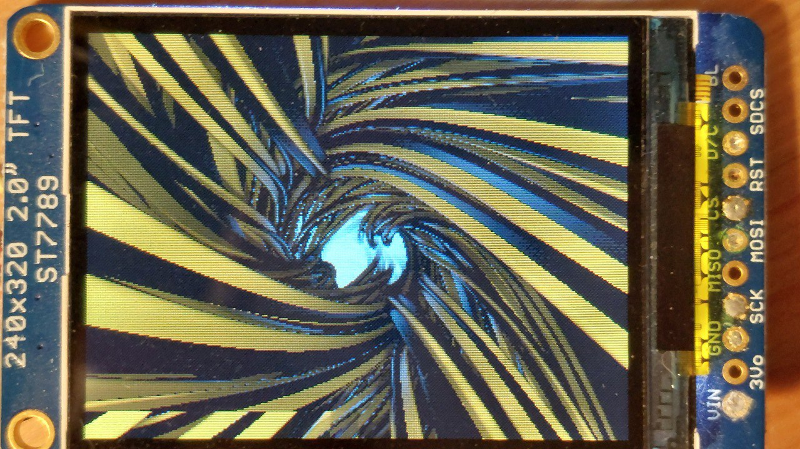
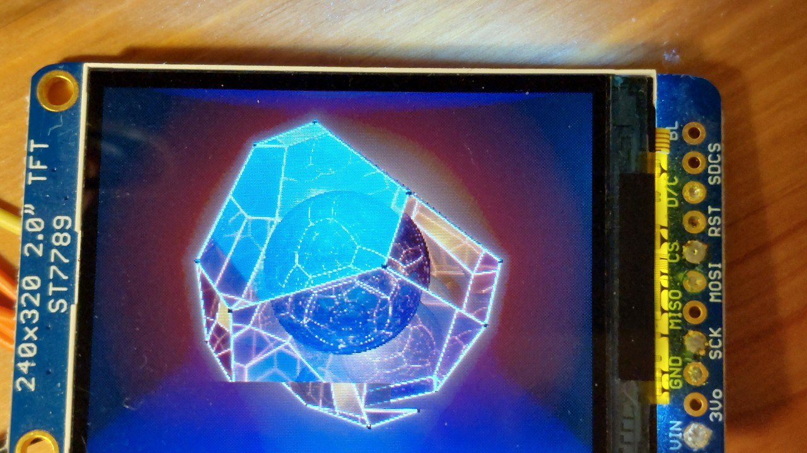
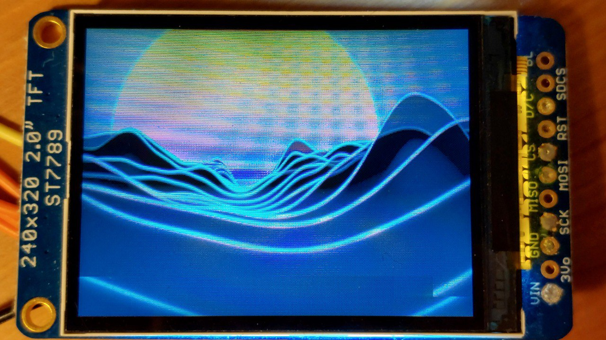

Slang on Raspberry Pico 2 W
===========================

This is a proof-of-concept of compiling and running [Slang](https://github.com/shader-slang/slang)
and GLSL code on a microcontroller. It is able to run Shadertoy shaders on the
microcontroller! Although, performance is measured in seconds per frame.

|  |
| --- |
| The program running ["A Dead Planet of Silicon Dreams"](https://www.shadertoy.com/view/WfGfzK) by mrange |

**NOTE** that none of the code in the `shaders` folder is mine; they're just
example shaders from Shadertoy that work with this program! Their respective
licenses are found at the beginning of the shader files. You can add more
shaders in that directory and they will automatically be compiled into the
program.

## What's special about this?

Slang (in its current form) is a shading language. This means that it's usually
used to write code to run on GPUs. The "special" part of this project is running
that GPU code on something it's absolutely not meant to be run on: an
underpowered microcontroller, without any operating system or interpreter!

`slangc`, the Slang compiler, also supports compiling GLSL and HLSL code; this
means that in addition to Slang, it is possible to compile GLSL and HLSL into
CPU programs on bare metal now.

This is not a simple transpiler hack - the Slang/GLSL code is never compiled
into C or C++ or any other high-level language. Instead, the new LLVM emitter
of `slangc` is used to directly emit object code for the microcontroller.

Several, now merged PRs to Slang were necessary to make this work:
[9491](https://github.com/shader-slang/slang/pull/9491),
[9492](https://github.com/shader-slang/slang/pull/9492),
[9493](https://github.com/shader-slang/slang/pull/9493), and
[9501](https://github.com/shader-slang/slang/pull/9501).

## Build

To test this out, use the v2026.1 release of Slang and place `slangc` in `PATH`.

This has only been tested on a single setup:
* Host: OpenSUSE Tumbleweed, x86\_64
* Microcontroller: Raspberry Pico 2 W

The GCC 15 toolchain is used for pico-sdk, and the Slang compiler is using
LLVM 21. The `PICO_SDK_PATH` environment variable must be defined to point to
pico-sdk. Other than that, there shouldn't be anything special.

The [`pico.slang`](pico.slang) bindings to pico-sdk have been generated with
[this binding generator](https://github.com/juliusikkala/slang-cpu-utils/tree/llvm/bindgen-llvm).
It has been generated using flags that are specifically correct for the
Pico 2 W, so this project only works on that device currently.

With all this in place, you should be able to just:
```
cmake -S . -B build -DCMAKE_BUILD_TYPE=Release [-DOVERCLOCK]
cmake --build build
cp build/picotoy.uf2 /run/media/username/RP2350
```

If you connect the USB to your Linux PC, you can observe the `printf`s with:
```
screen /dev/ttyACM0 115200
```
The program prints some basic performance metrics for each frame.

## Hardware

* Raspberry Pi Pico 2 W
    - Using the Cortex M33 CPU, no RISC-V support yet
* [Adafruit 2.0" 240x320 IPS TFT LCD](https://www.adafruit.com/product/4311)
    - Display SPI pins connected to Pico's SPI0
    - D/C in GPIO 21, RESET in GPIO 20
* Two push buttons to cycle between shaders
    - They connect GPIO 14 & 15 to ground when connected
    - Internal pull-up resistors are used, you don't need external resistors

## Gallery / Performance

|  |
| --- |
| The overall setup (pre-overclock) |

Timings are measured using `-DOVERCLOCK` (overclocks the Pico to 532 MHz) and
both Cortex  M33 cores, using a release build. The performance results are
averaged over 10 frames and reported in SPF (Seconds Per Frame).

|  |
| --- |
| ["A Dead Planet of Silicon Dreams"](https://www.shadertoy.com/view/WfGfzK) by mrange, 11.1 SPF |

|  |
| --- |
| ["Cable nest v2"](https://www.shadertoy.com/view/7ttcDj) by mrange, 4.8 SPF |

|  |
| --- |
| ["Let's self reflect"](https://www.shadertoy.com/view/XfyXRV) by mrange, 2.2 SPF |

|  |
| --- |
| ["Starry planes"](https://www.shadertoy.com/view/MfjyWK) by mrange, 0.37 SPF (2.7 FPS, whoa!) |

|  |
| --- |
| ["Synthwave canyon"](https://www.shadertoy.com/view/slcXW8) by mrange, 2.2 SPF |
