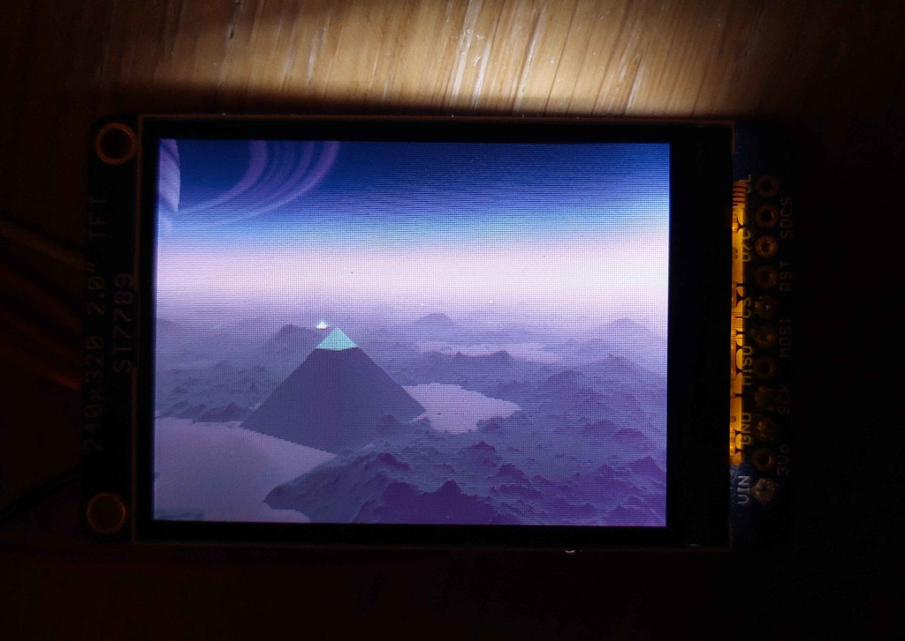

Slang on Raspberry Pico 2 W
===========================

This is a proof-of-concept of compiling [Slang](https://github.com/shader-slang/slang)
code to run on a microcontroller. It is able to run Shadertoy shaders on the
microcontroller! Although, performance is measured in minutes per frame.

**NOTE** that none of the code in the `shaders` folder is mine; they're just
example shaders from Shadertoy that work with this program! Their respective
licenses are found at the beginning of the shader files.

|  |
| --- |
| The program running ["A Dead Planet of Silicon Dreams"](https://www.shadertoy.com/view/WfGfzK) by mrange |

As of writing, this doesn't yet work on the upstream Slang compiler; it requires
PRs [9491](https://github.com/shader-slang/slang/pull/9491),
[9492](https://github.com/shader-slang/slang/pull/9492), and
[9493](https://github.com/shader-slang/slang/pull/9493). To test this out,
create a new branch from the `master` branch of Slang and merge those PRs
locally.

This has only been tested on a single setup:
* Host: OpenSUSE Tumbleweed, x86\_64
* Microcontroller: Raspberry Pico 2 W

The GCC 15 toolchain is used for pico-sdk, and the Slang compiler is using
LLVM 21.

The [`pico.slang`](pico.slang) bindings to pico-sdk have been generated with
[this binding generator](https://github.com/juliusikkala/slang-cpu-utils/tree/llvm/bindgen-llvm).
It has been generated using flags that are specifically correct for the
Pico 2 W, so this project only works on that device currently.

This is currently specifically using the Cortex M33 CPU, not the Hazard3 RISC-V
CPU on the device. I'm curious about the latter, but haven't bothered with the
toolchain setup yet.

## Hardware

* Raspberry Pi Pico 2 W
* [Adafruit 2.0" 240x320 IPS TFT LCD](https://www.adafruit.com/product/4311)
    - Display SPI pins connected to Pico's SPI0
    - D/C in GPIO 21, RESET in GPIO 20

## How's it work?

It's actually pretty straightforward. `pico.slang` forward declares all
necessary functions from pico-sdk. The Slang code is compiled into object code,
which is then linked with the pico-sdk libraries using the normal GCC-based
toolchain.

The new LLVM emitter of `slangc` is used to compile the Slang code - it's never
transpiled into C or C++, the object code is emitted directly instead. Some
really specific flags have to be passed to LLVM for it to produce correct object 
code for this platform - see `CMakeLists.txt`. One of those PRs is needed to
allow passing flags directly to the LLVM backend.

This is a 32-bit microcontroller, and Slang used to have some pretty broken
support for 32-bit pointers, so one of the PRs fixes that. But after that, it
was pretty much smooth sailing.
